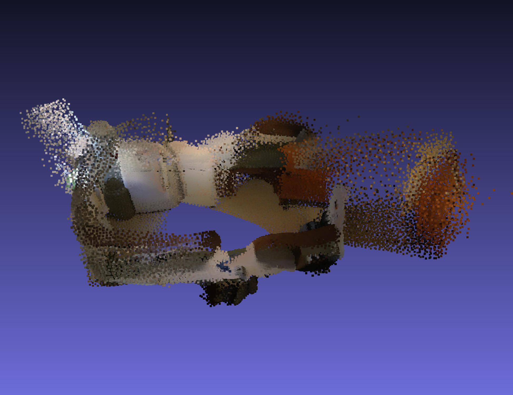
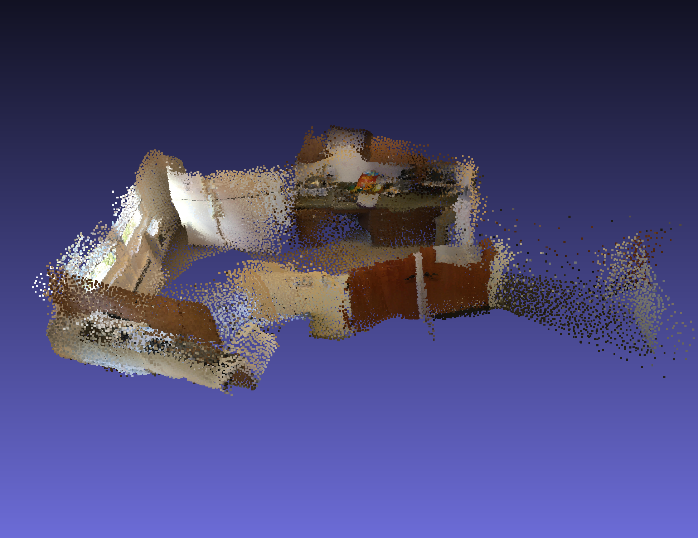
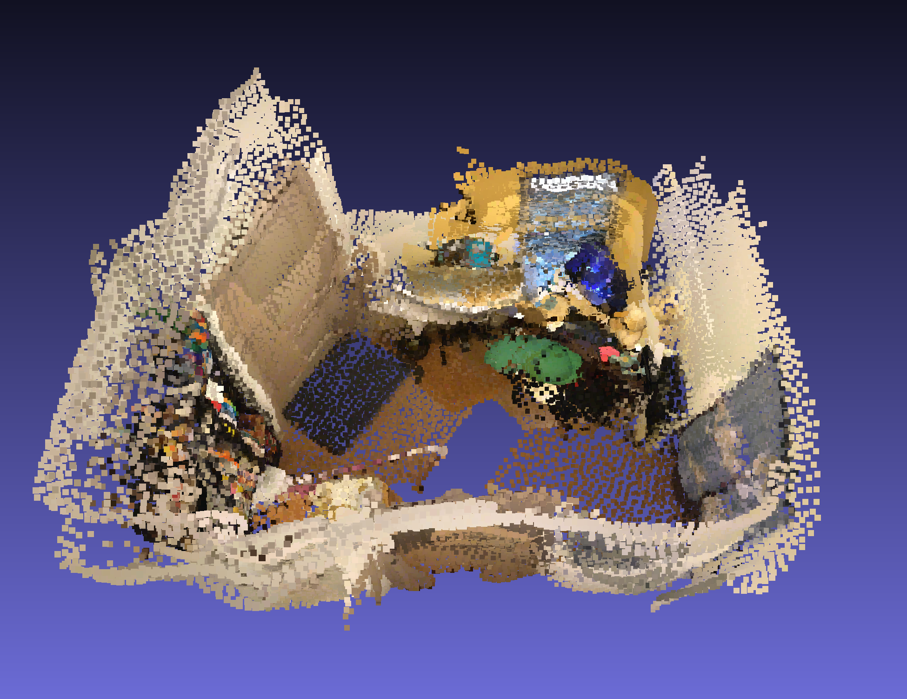
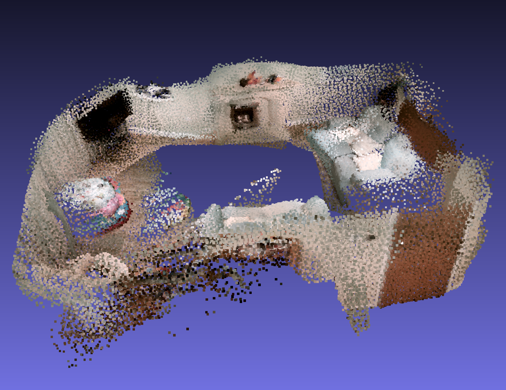
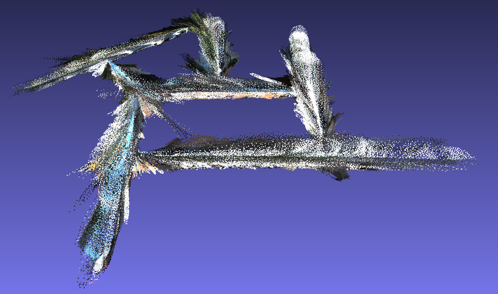

# RidgeSfM: Structure from Motion via Robust Pairwise Matching Under Depth Uncertainty
_Benjamin Graham, David Novotny_<br/>
[3DV 2020](http://3dv2020.dgcv.nii.ac.jp/)

This is the official implementation of **RidgeSfM: Structure from Motion via Robust Pairwise Matching Under Depth Uncertainty** in PyTorch.

[Link to paper](https://arxiv.org/abs/2011.10359) | [Poster](ridgesfm_poster.pdf)

<a href="output/scannet/" rel="some text"></a>


## RidgeSfM applied to the ScanNet test set


<table>
	<tr>
		<td>

[**Scene 0707_00 frame skip rate _k=1_**](output/scannet/0707/README.md)  <br/>
<a href="output/scannet/0707/README.md"></a>

  </td>
  <td>

[**Scene 0708_00 frame skip rate _k=3_**](output/scannet/0708/README.md)  <br/>
<a href="output/scannet/0708/README.md"></a>

</td>
	</tr>
	<tr>
		<td>

[**Scene 0709_00 frame skip rate _k=10_**](output/scannet/0709/README.md)  <br/>
<a href="output/scannet/0709/README.md"></a>

   </td>
   <td>

[**Scene 0710_00 frame skip rate _k=30_**](output/scannet/0710/README.md)  <br/>
<a href="output/scannet/0710/README.md"></a>

  </td>
	</tr>
</table>

Below we illustrate the depth uncertainty factors of variation for a frame from scene 0708.<br/>
<table><tr><td>
<br/>
Top left: an input image. <br/>
Bottom left: the predicted depth. <br/>
Middle and right: We use SVD to reduce the 32 FoV planes down to 12 planes, and display them as 4 RGB images; each of the 4x3 color planes represents one factor of variation.
</td></tr></table>


## RidgeSfM applied to a video taken on a mobile phone

We applied RidgeSfM to a short video taken using a mobile phone camera.
There is no ground truth pose, so the bottom right hand corner of the video is blank.

<table>
	<tr>
		<td>

[**Living room - skip rate _k=3_**](output/cubot/scene0/README.md)  <br/>
<a href="output/cubot/scene0/README.md"></a>

</td>
</tr>
</table>

## RidgeSfM applied to the KITTI odometry dataset

We trained a depth prediction network on the [KITTI depth prediction](http://www.cvlibs.net/datasets/kitti/eval_depth.php?benchmark=depth_prediction) training set. We then processed videos from the [KITTI Visual Odometry dataset](http://www.cvlibs.net/datasets/kitti/eval_odometry.php). We used the 'camera 2' image sequences, cropping the input to RGB images of size 1216x320\. We used R2D2 as the keypoint detector. We used a frame skip rate of _k_=3\. The scenes are larger spatially, so for visualization we increased the number of K-Means centroids to one million.

<table>
	<tr>
		<td>

[**Scene 6 - skip rate _k=3_**](output/kitti/scene6/README.md)  <br/>
<a href="output/kitti/scene6/" rel="some text"></a>

  </td>
  <td>

[**Scene 7 - skip rate _k=3_**](output/kitti/scene7/README.md)  <br/>
<a href="output/kitti/scene7/" rel="some text"></a>

  </td>
  </tr>
</table>

# Setup

- Download [SuperPoint](https://openaccess.thecvf.com/content_cvpr_2018_workshops/papers/w9/DeTone_SuperPoint_Self-Supervised_Interest_CVPR_2018_paper.pdf) to ridgesfm/
```
wget https://github.com/magicleap/SuperGluePretrainedNetwork/blob/master/models/weights/superpoint_v1.pth?raw=true -O ridgesfm/weights/superpoint_v1.pth
wget https://raw.githubusercontent.com/magicleap/SuperGluePretrainedNetwork/master/models/superpoint.py -O ridgesfm/superpoint.py
```
- To download one test scene:
  - Download [scannet.zip](https://drive.google.com/file/d/1OP2IYrsbtP2gyEfXPIUAmkBTp-YWqRzS/view?usp=sharing) to RidgeSfM/ridgesfm/data and check that `RidgeSfM/ridgesfm/data/scannet/test_scenes/0707_00/seq=0707_00-maxframes=300-frameskip=10-start=1.pth` exists.
  - Run `python ridgesfm.py scene.n=0 scene.frameskip=10`
- To prepare the full ScanNet dataset:
  - Download the [ScanNet dataset](http://www.scan-net.org/) to `ridgesfm/data/scannet_sens/[train|test]/`
  - Download [SensReader](https://github.com/ScanNet/ScanNet/tree/master/SensReader/python) to `ridgesfm/data`
  - Run `bash prepare_scannet.sh` in `ridgesfm/data/`
  - Run `python ridgesfm.py scene.n=x scene.frameskip=y` with `x` = 0,1,...,98 or 99 and `y` = 1,3,10 or 30

# To process your own video
- calibrate your camera using `calibrate/calibrate.ipynb`
- then run `python ridgesfm.py scenes=calibrate/ scene.n=0 scene.frameskip=10`
<a/>
Videos are scaled and/or cropped to resoltion 640x480. The notebook calculates a camera intrinsic matrix for the rescaled video. RidgeSfM will work best when the C.I. matrix is similar to that of the depth prediction network's training data, i.e. [[578, 0, 319.5], [0, 578, 239.5], [0, 0, 1]].

## Dependencies:
- Python 3.7+
- PyTorch and TorchVision
- [Faiss](https://github.com/facebookresearch/faiss)
- [PyKeOps](https://pypi.org/project/pykeops/)
- OpenCV
- imageio and imageio-ffmpeg
- [PyTorch3D](https://github.com/facebookresearch/pytorch3d)

## License
RidgeSfM is CC-BY-NC licensed, as found in the LICENSE file. [Terms of use](https://opensource.facebook.com/legal/terms). [Privacy](https://opensource.facebook.com/legal/privacy)

## Citations

If you find this code useful in your research then please cite:

```
@InProceedings{ridgesfm2020,
    author       = "Benjamin Graham and David Novotny",
    title        = "Ridge{S}f{M}: Structure from Motion via Robust Pairwise Matching Under Depth Uncertainty",
    booktitle    = "International Conference on 3D Vision (3DV)",
    year         = "2020",
}
```
