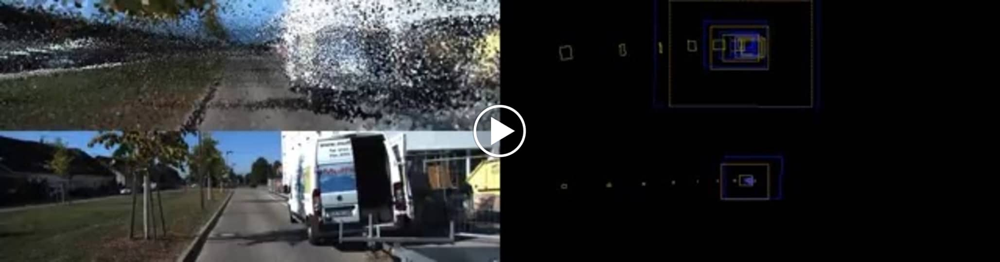
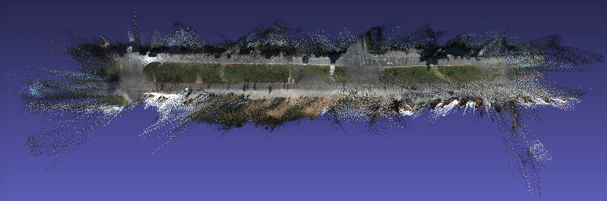

# KIITI VO scene 6 - frame skip _k=3_

The videos below show RidgeSfM reconstructions for KITTI VO scene 6 (using every 3rd frame).

We trained a depth prediction network on the <a href="http://www.cvlibs.net/datasets/kitti/eval_depth.php?benchmark=depth_prediction"> KITTI depth prediction</a> training set.
We then processed scene 6 from the <a href="http://www.cvlibs.net/datasets/kitti/eval_odometry.php">KITTI Visual Odometry dataset</a>.
We used the 'camera 2' image sequences, cropping the input to RGB images of size 1216x320. We used R2D2 as the keypoint detector.

For each scene, we use the reconstructed depth and camera parameters to reproject the pixels to form a point cloud.
Each point in the cloud has the form _(x,y,z,r,g,b)_ ∈ ℝ6.
To simplify the point-cloud, we use K-Means to extract 1,000,000 centroids.

<table style="table-layout: fixed; width: 100%;">
<thead>
  <tr>
    <th colspan="2">For each video</th>
  </tr>
</thead>
<tbody>
  <tr>
    <td>Top left: the rendered point cloud. </td>
    <td>Top right: The focal-plane trajectory for the predicted camera locations.</td>
  </tr>
  <tr>
    <td>Bottom left: The input video.</td>
    <td>Bottom right: The focal-plane trajectory of the ground truth camera locations.</td>
  </tr>
  <tr>
  <td colspan="2">

</td>
  </tr>
</tbody>

<thead>
  <tr>
    <th colspan="2">Using MeshLab to display the point cloud:</th>
  </tr>
</thead>

<tr>
<td colspan="2"></td>
</tr>
</table>
