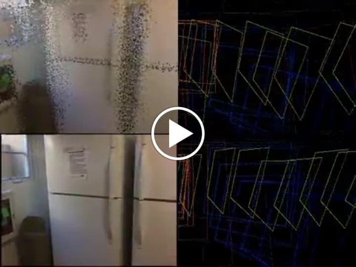
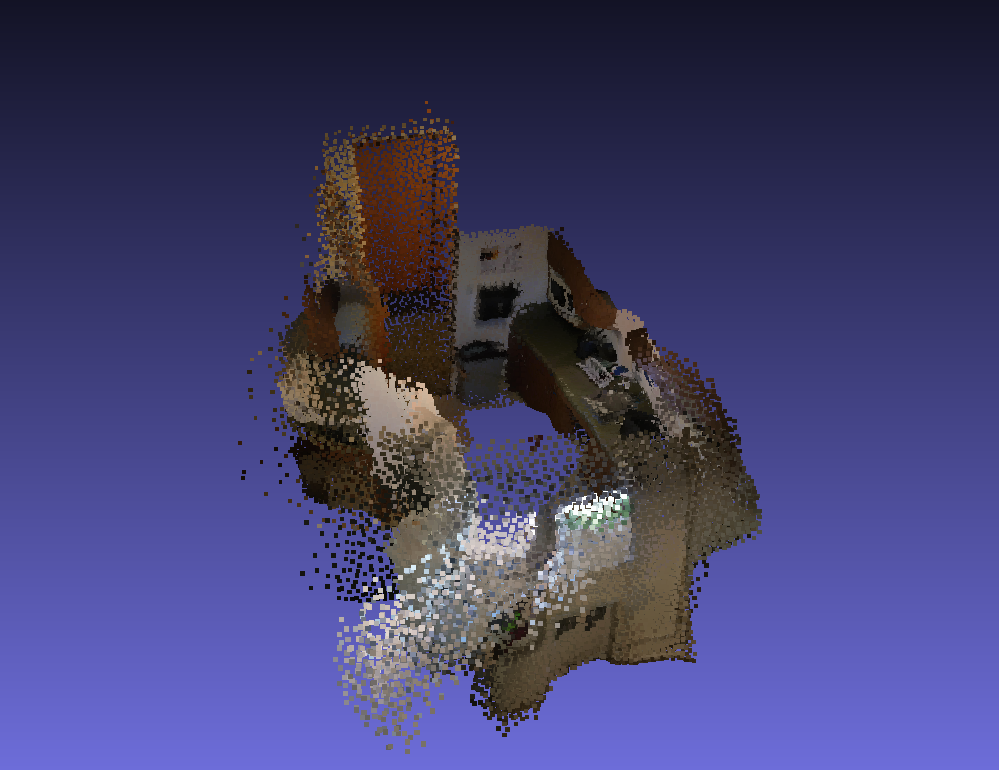
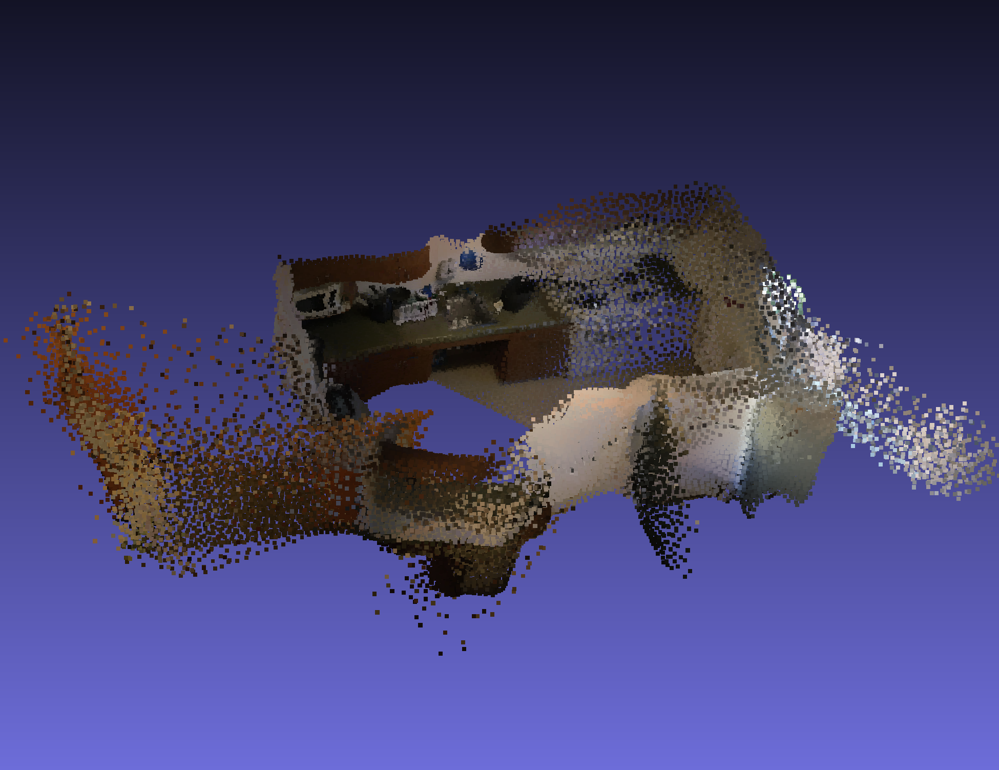
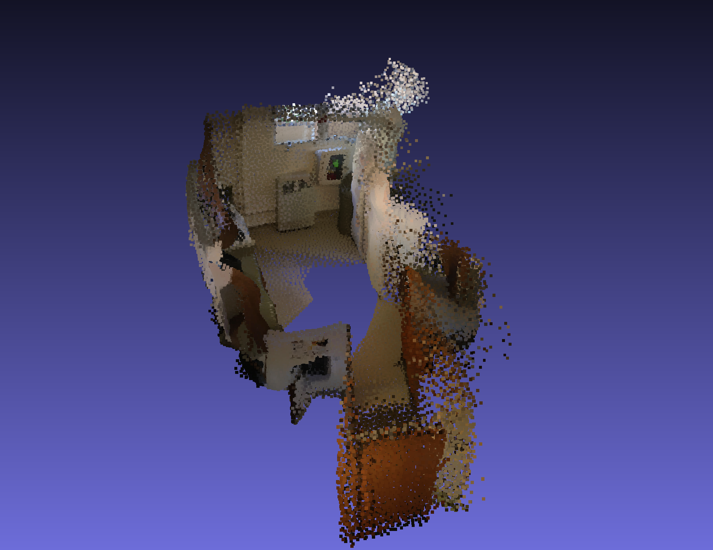

# ScanNet scene 0707 - frame skip _k=1_

The videos below show RidgeSfM reconstructions for ScanNet test scene 0707 (using all frames).

For each scene, we use the reconstructed depth and camera parameters to reproject the pixels to form a point cloud.
Each point in the cloud has the form _(x,y,z,r,g,b)_ ∈ ℝ6.
To simplify the point-cloud, we use K-Means to extract 100,000 centroids.

<table style="table-layout: fixed; width: 100%;">
<thead>
  <tr>
    <th colspan="2">For each video</th>
  </tr>
</thead>
<tbody>
  <tr>
    <td>Top left: the rendered point cloud. </td>
    <td>Top right: The focal-plane trajectory for the predicted camera locations.</td>
  </tr>
  <tr>
    <td>Bottom left: The input video.</td>
    <td>Bottom right: The focal-plane trajectory of the ground truth camera locations.</td>
  </tr>
  <tr>
  <td colspan="2">

</td>
  </tr>
</tbody>

<thead>
  <tr>
    <th colspan="2">Using MeshLab to display the point cloud <a href="scene0_frameskip1.ply"> PLY file </a></th>
  </tr>
</thead>

<tr>
<td></td>
<td></td>
</tr>
<tr>
<td></td>
<td></td>
</tr>
</table>
